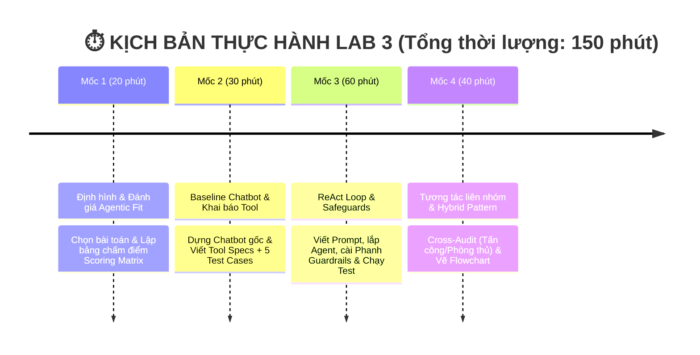

# 🏫 BÀI LAB 3: CHATBOT VS REACT AGENT - TỪ Ý TƯỞNG ĐẾN THỰC THI

---

### 💡 1. LỜI NÓI ĐẦU & NỀN TẢNG LÝ THUYẾT (4 CẤP ĐỘ AI HỘI THOẠI)

Bài Lab giúp bạn hiểu rõ sự tiến hóa qua 4 cấp độ của hệ thống AI:

| Cấp độ | Loại hệ thống | Đặc điểm chính | Sự xuất hiện trong Bài Lab |
| :---: | :--- | :--- | :--- |
| **Cấp 1** | **Rule-Based Bot** | Khớp từ khóa if/else cố định, không có LLM | *Minh họa lịch sử* |
| **Cấp 2** | **LLM Chatbot** | Dùng LLM sinh text mượt, nhưng không gọi được Tool | **Chatbot Baseline** (Phần thực hành 1) |
| **Cấp 3** | **Reactive Agent** | Suy luận `Thought -> Action -> Observation` & gọi Tool | **ReAct Agent Loop** (Trọng tâm Bài Lab) |
| **Cấp 4** | **Autonomous Agent** | Tự rã mục tiêu (Planning), tự đánh giá & có Memory | 🎁 **Phần Bonus Nâng cao (+10%)** |

* 🤖 **Chatbot thông thường (Cấp 2)**: Giống như một **chuyên gia lý thuyết** — chỉ trả lời dựa trên kiến thức tĩnh có sẵn trong LLM, không thể tra cứu số liệu thực tế hay tự thực hiện thao tác.
* 🧠 **ReAct Agent (Cấp 3)**: Giống như một **trợ lý thực hành** — vừa biết suy nghĩ (**Thought**), vừa biết chủ động dùng công cụ (**Action**) như phần mềm tra cứu/tính toán, và quan sát kết quả (**Observation**) để giải quyết các bài toán thực tế.

---

### 📂 2. CẤU TRÚC THƯ MỤC DỰ ÁN

> 🎯 **Đề tài nhóm chọn (Đề tài 9)**: **Trợ Lý Sàng Lọc Hồ Sơ Tuyển Dụng & Hẹn Phỏng Vấn** — đọc CV ứng viên, chấm mức độ phù hợp với JD và hỗ trợ đặt lịch phỏng vấn. Chi tiết tại [PLAN.md](PLAN.md).

```text
📁 DAY03_2A202601113_NguyenHuyHoang/
├── 📄 README.md                 <-- 📘 Tổng quan kiến trúc & Thang điểm
├── 📄 PLAN.md                   <-- 🗺️ Đề bài, phạm vi & kịch bản demo của nhóm
├── 📄 .env.example              <-- 🔑 File mẫu API Key (.env thật bị .gitignore chặn)
├── 📄 requirements.txt          <-- 📦 Thư viện cần cài đặt
│
├── 📁 config/                   <-- 🛠️ CẤU HÌNH
│   └── 📄 test_cases.json       <-- 🟢 [Role 1] 12 Test Cases (JD + CV) kèm rubric & điểm kỳ vọng
│
├── 📁 data/                     <-- 🗄️ DỮ LIỆU THẬT CHO TOOL TRA CỨU
│   ├── 📄 JOB_DATA_FINAL.csv    <-- 14.634 tin tuyển dụng
│   ├── 📄 USER_DATA_FINAL.csv   <-- 3.983 hồ sơ ứng viên
│   └── 📄 interviewers.json     <-- Lịch trống của phỏng vấn viên
│
├── 📁 src/                      <-- 💻 MÃ NGUỒN PYTHON
│   ├── 📄 app.py                <-- 🚀 [Role 4] Entry point: nạp test case & chạy 2 nhánh so sánh
│   ├── 📄 agent_core.py         <-- ⚙️ [Role 4] Lõi vòng lặp ReAct: parse Thought/Action, gọi tool, dựng trace
│   ├── 📄 tools.py              <-- 🛠️ [Role 2] 7 công cụ chỉ-đọc truy vấn data/*.csv
│   ├── 📄 prompts.py            <-- 🧠 [Role 3] ReAct System Prompt & Guardrails (MAX_ITERATIONS)
│   ├── 📄 providers.py          <-- 🔌 Adapter đa nhà cung cấp LLM (OpenAI/Gemini/Anthropic/OpenRouter/Mock)
│   └── 📁 ai_levels/            <-- 📚 Minh họa 4 cấp độ AI ở mục 1 (chạy độc lập, không nằm trong luồng app)
│       ├── 📄 level1_rule_based.py       <-- Bot if/else, không dùng LLM
│       ├── 📄 level2_llm_chatbot.py      <-- LLM Chatbot, không có Tool
│       ├── 📄 level3_reactive_agent.py   <-- ReAct Agent rút gọn
│       └── 📄 level4_autonomous_agent.py <-- Autonomous Agent (Planning & Memory)
│
└── 📁 docs/                     <-- 📚 TÀI LIỆU HƯỚNG DẪN & BÁO CÁO
    ├── 📄 CODELAB.md            <-- 🎓 [LMS Format] Hướng dẫn thực hành từng bước Codelab
    ├── 📄 PHAN_CONG_CONG_VIEC.md <-- 📋 [BẮT ĐẦU TẠI ĐÂY] Sổ tay thực hành & Checklist 5 Roles
    ├── 📄 DANH_SACH_DE_TAI.md    <-- 💡 Danh sách 10 chủ đề gợi ý
    ├── 📄 TOOL_SPECS.md          <-- 🛠️ [Role 2] Đặc tả input/output từng Tool
    ├── 📄 trace_eval.md          <-- 📊 [Role 5] Báo cáo Log Trace & Đánh giá Agentic Fit
    └── 📄 hybrid_flowchart.mermaid <-- 🔀 [Role 5] Sơ đồ phân luồng Chatbot path vs ReAct path
```

#### 🔄 Luồng xử lý một Test Case

**Bước 1 — Dựng câu hỏi và chia hai nhánh** (`src/app.py`)

```text
 config/test_cases.json  [Role 1] ─┐
 src/prompts.py          [Role 3] ─┴──> src/app.py
                                            │
                                            │  format_test_case_query(test_case)
                                            │  • có trường "question" ──> dùng nguyên văn
                                            │  • không có             ──> ghép JD + candidate
                                            ▼
                                  MỘT CÂU HỎI DUY NHẤT
                                            │
                       ┌────────────────────┴────────────────────┐
                       ▼                                         ▼
                  [NHÁNH 1]                                 [NHÁNH 2]
              Chatbot Baseline                              ReAct Agent
           run_baseline_chatbot()                       run_react_agent()
                       │                                         │
                       ▼                                         ▼
             providers.py ──> LLM                  agent_core.run_react_agent()
            đúng 1 lần gọi, 0 tool                 vòng lặp ReAct ──> Bước 2
                       │                                         │
                       ▼                                         ▼
            {answer, tool_calls: 0}                   {answer, trace, tool_calls,
                                                       termination_reason}
```

Trước khi vào vòng lặp, `app.py` còn **nạp thêm đồ nghề riêng cho nhánh 2**:

* Lấy toàn bộ **7 tool chỉ-đọc** trong `src/tools.py` (`AVAILABLE_TOOLS`).
* Nếu test case có `expected_score_breakdown`, bơm thêm tool thứ 8 là `score_test_case[id]` (dựng ngay từ rubric của Role 1) và nối hướng dẫn dùng tool đó vào cuối `REACT_SYSTEM_PROMPT`. **Cả 12 test case hiện tại đều có rubric**, nên trên thực tế Agent luôn chạy với 8 tool.
* Sau khi vòng lặp kết thúc, nếu Agent *không* gọi `score_test_case`, `app.py` tự nối bảng điểm (`format_scorecard`) vào cuối câu trả lời để HR luôn nhìn thấy scorecard.

**Bước 2 — Bên trong vòng lặp ReAct** (`src/agent_core.py`, lặp tối đa `MAX_ITERATIONS = 15`)

```text
 ┌──> _build_user_context()
 │    ghép câu hỏi gốc + TOÀN BỘ trace của các bước trước
 │    │
 │    ▼
 │    providers.py ──> LLM ──> "Thought: ... / Action: ..."
 │    │
 │    ▼  parse_agent_response()  — luôn dò "Final Answer" TRƯỚC
 │    │
 │    ├── "Final Answer: ..."  ──> 🚪 THOÁT · final_answer
 │    │
 │    ├── sai định dạng  ──> 🛡️ ghi parse_error vào trace
 │    │                      đủ 2 lần (cộng dồn) ──> 🚪 THOÁT · parse_error
 │    │
 │    └── "Action: tên[tham_số]"
 │         │
 │         ├── trùng Action đã chạy ──> 🛡️ chặn; Observation yêu cầu đổi hướng
 │         │
 │         └── Action mới
 │              │
 │              ▼
 │              execute_tool() ──> src/tools.py ──> data/*.csv
 │              │
 │              ▼
 │              Observation  (mọi lỗi đều thành chuỗi "LỖI: ...";
 │              │             execute_tool không bao giờ ném exception ra ngoài)
 └──────────────┘

 Hết 15 vòng mà vẫn chưa có Final Answer
 ──> 🛡️ 🚪 THOÁT · max_iterations  (trả câu xin lỗi, không bịa dữ liệu)
```

Hai nhánh nhận **cùng một câu hỏi** để so sánh công bằng. Nhánh 1 chỉ có kiến thức tĩnh trong LLM nên `tool_calls` luôn bằng `0` — đây chính là bằng chứng định lượng cho thấy Chatbot không có công cụ.

Vòng lặp ở nhánh 2 có **bốn phanh an toàn**: hai phanh làm **dừng hẳn** vòng lặp, hai phanh còn lại chỉ **nắn lại hướng đi** của Agent.

| Phanh | Cơ chế | Kết quả | Nơi cài đặt |
| :--- | :--- | :--- | :--- |
| 🛡️ Giới hạn vòng lặp | Chạy tối đa `MAX_ITERATIONS = 15` bước | 🚪 dừng · `max_iterations` | `agent_core.py:107` |
| 🛡️ Sai định dạng | Không đọc được Action/Final Answer, cộng dồn đủ 2 lần thì dừng | 🚪 dừng · `parse_error` | `agent_core.py:120-140` |
| 🛡️ Chống lặp | `seen_actions` phát hiện Action trùng hệt, chặn không cho chạy lại | ↩️ không dừng | `agent_core.py:142-150` |
| 🛡️ Bọc lỗi tool | Tool không tồn tại / sai tham số / crash đều thành chuỗi `"LỖI: ..."` | ↩️ không dừng | `agent_core.py:53-71` |

Nhờ hai phanh *không dừng*, Agent **đọc được lỗi và tự sửa hướng** thay vì làm sập chương trình — và nhờ hai phanh *dừng hẳn*, trường hợp xấu nhất vẫn trả về câu xin lỗi lịch sự chứ không bịa dữ liệu.

**Chạy thử:**

```bash
pip install -r requirements.txt
cp .env.example .env        # điền API key và LLM_PROVIDER

python src/app.py           # demo nhanh: 1 test case (id = 3) chạy qua cả 2 nhánh
python src/app.py --all     # chạy trọn 12 test case trong config/test_cases.json
# đặt LLM_PROVIDER=mock trong .env để chạy offline, không tốn API
```

---

### ⏱️ 3. LỘ TRÌNH THỰC HÀNH (4 MỐC / 150 PHÚT)



---

### 💯 4. CƠ CHẾ CHẤM ĐIỂM  (SCORING RUBRIC)

| Tiêu chí                                |  Trọng số  | Mô tả chi tiết                                                                                                             | Bằng chứng kiểm tra (Artifacts)                                        |
| :---------------------------------------- | :-----------: | :---------------------------------------------------------------------------------------------------------------------------- | :------------------------------------------------------------------------ |
| **1. Agentic Fit & Test Design**    | **20%** | Phân tích đúng 4 tiêu chí Agentic Fit cho chủ đề tự chọn. Bộ test cases đủ góc cạnh (đơn giản, multi-step, edge cases). | Bảng chấm điểm (`docs/trace_eval.md`) + `config/test_cases.json`. |
| **2. ReAct Implementation & Tools** | **30%** | Tool description rõ ràng. Vòng lặp ReAct chạy đúng chuẩn `Thought -> Action -> Observation`.                         | Code trong `src/tools.py` + `src/app.py`.                              |
| **3. Guardrails & Observability**   | **20%** | Bắt được lỗi loop, có max iterations (Guardrail). Trích xuất được ít nhất 1 Trace log hoàn chỉnh.                     | File `src/prompts.py` + Log trong `docs/trace_eval.md`.                |
| **4. Inter-group Attack & Defense** | **20%** | Phản biện tốt khi gọi ngẫu nhiên hoặc cử 1 bạn đi chấm chéo (+10đ). Agent chống đỡ tốt / fallback chuẩn (+10đ).        | Biên bản Cross-Audit / Trả lời phản biện.                             |
| **5. Hybrid Decision Flowchart**    | **10%** | Sơ đồ thể hiện rõ khi nào đi Chatbot path, khi nào đi ReAct Agent path.                                             | Sơ đồ Flowchart (`docs/hybrid_flowchart.mermaid`).                   |
| 🎁 **BONUS: Autonomous Agent**     | **+10%**| Thử nghiệm tính năng Planning (tự chia nhỏ mục tiêu) hoặc Memory cho Agent (Cấp 4).                                  | Demo code trong `src/app.py` hoặc giải trình trong report.           |

---

> 🚀 **BẮT ĐẦU LÀM BÀI**:
> Vui lòng mở sổ tay thực hành 👉 **[PHAN_CONG_CONG_VIEC.md](docs/PHAN_CONG_CONG_VIEC.md)** để xem phân vai và checklist công việc cụ thể cho từng thành viên!
